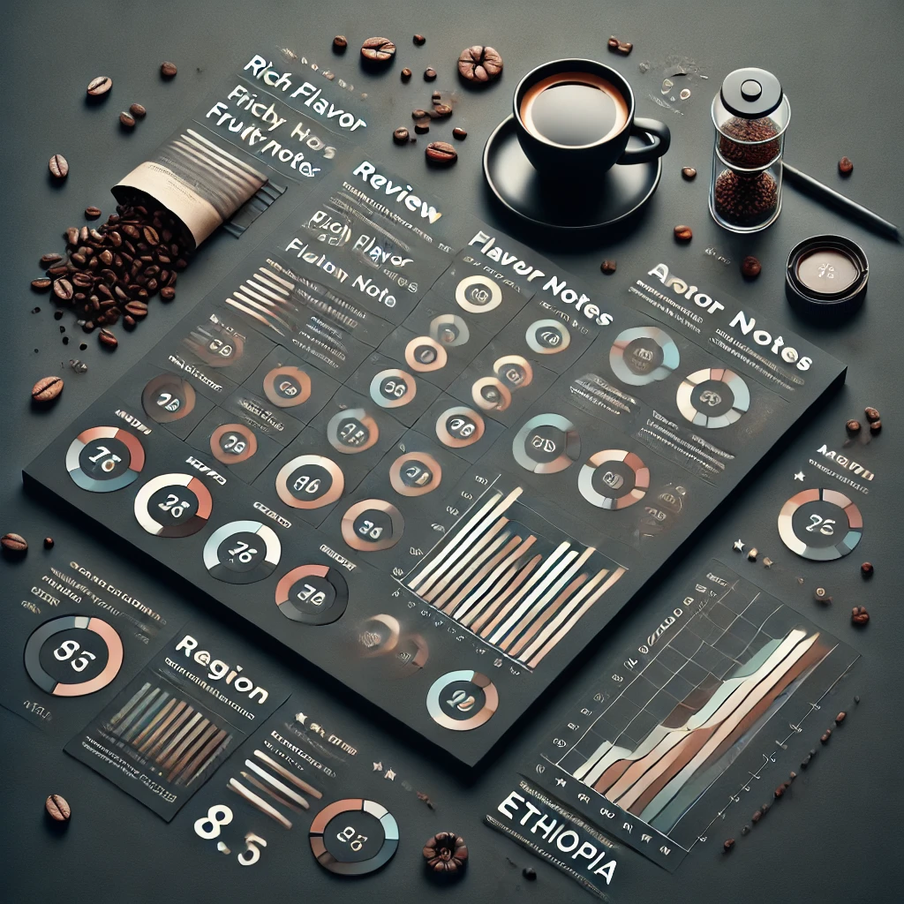

# Café com Dados: Uma Abordagem Analítica




O projeto Café com Dados tem como propósito principal explorar e analisar o Coffee Reviews Dataset, um conjunto de dados que reúne avaliações detalhadas de cafés. Por meio de técnicas avançadas de ciência de dados e análises estatísticas, o objetivo é extrair insights valiosos que possam orientar e embasar decisões estratégicas no setor cafeeiro. Este estudo visa não apenas compreender as tendências de mercado, mas também oferecer informações práticas que possam ser aplicadas para otimizar produtos e estratégias de negócio.


## Objetivos

- **Análise Exploratória de Dados (EDA)**: Investigar a distribuição e as correlações entre diferentes variáveis relacionadas ao café.
- **Modelagem Preditiva**: Aplicar algoritmos de machine learning para prever variáveis importantes como a qualidade do café, o preço e as tendências de consumo.
- **Visualização de Dados**: Criar visualizações informativas para facilitar a interpretação dos dados e os insights obtidos.

## Tecnologias Utilizadas

- **Python**: Linguagem de programação para análise de dados.
- **Pandas**: Biblioteca para manipulação e análise de dados.
- **NumPy**: Biblioteca para operações numéricas.
- **Matplotlib & Seaborn**: Bibliotecas para visualização de dados.
- **Scikit-learn**: Biblioteca para modelagem preditiva.
- **Jupyter Notebook**: Ambiente interativo para execução de scripts.

## Estrutura do Projeto

- `data/`: Contém os arquivos de dados utilizados no projeto.
- `notebooks/`: Jupyter notebooks com análises e modelagens.
- `scripts/`: Scripts Python para execução de etapas específicas do processo de análise e modelagem.
- `README.md`: Este arquivo, contendo as informações sobre o projeto.

## Como Rodar

1. **Clone o repositório:**

   ```bash
   git clone https://github.com/EdPLima/coffee-data-science.git
   cd coffee-data-science
